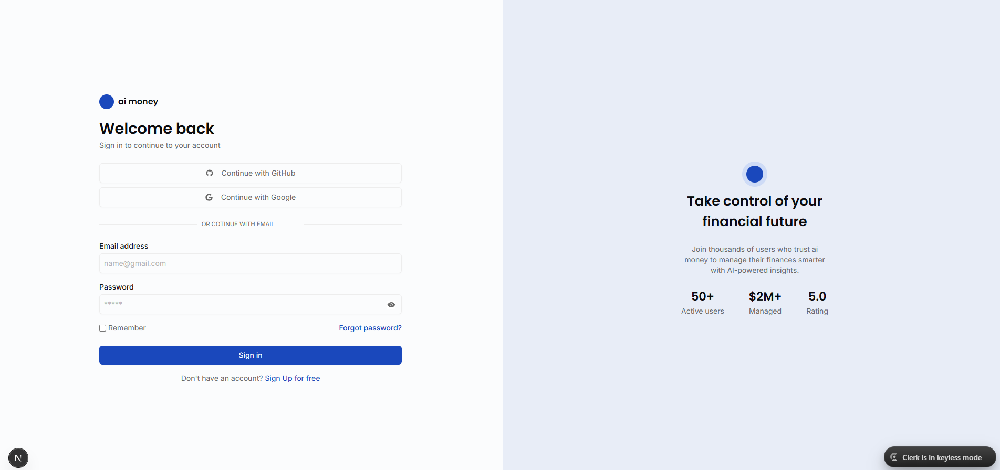
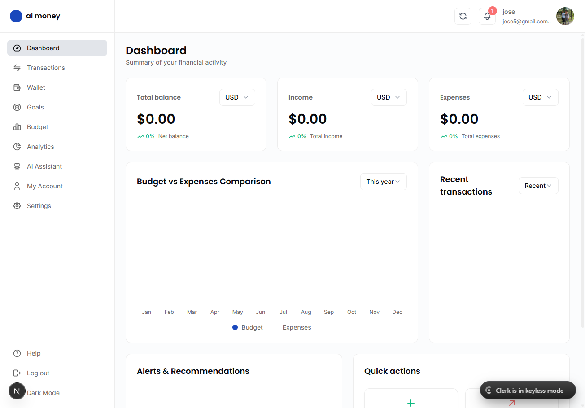
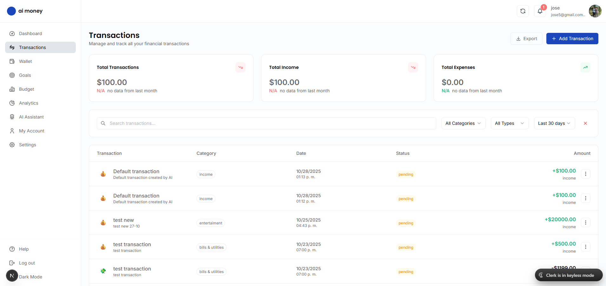
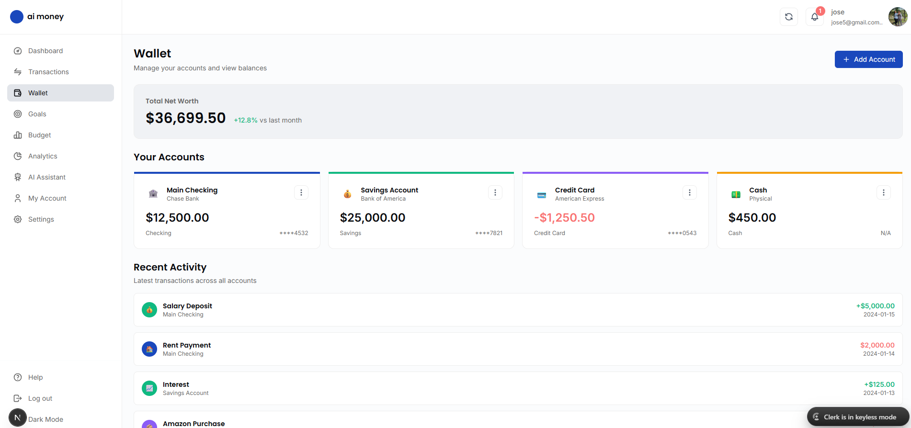
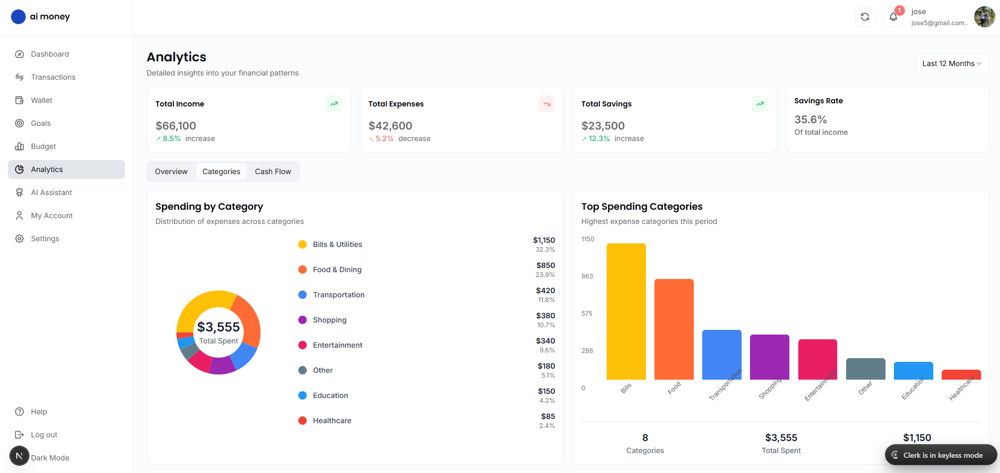
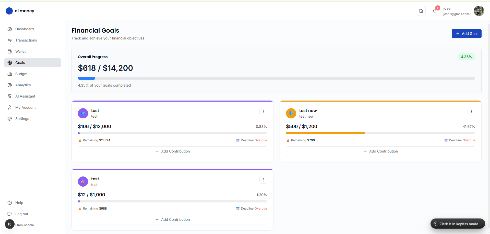
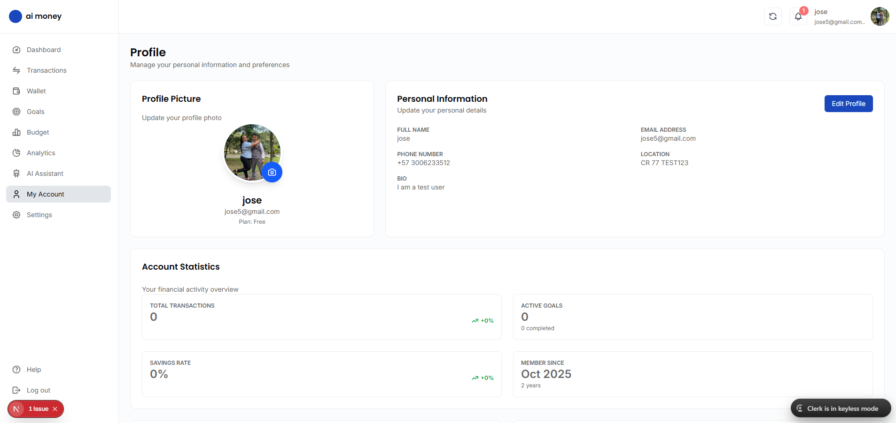
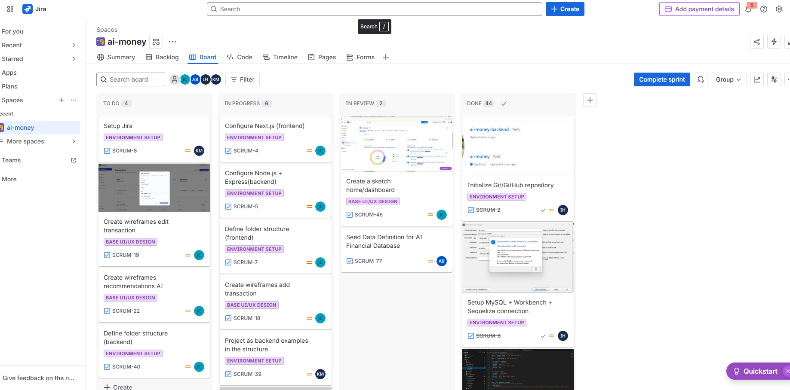
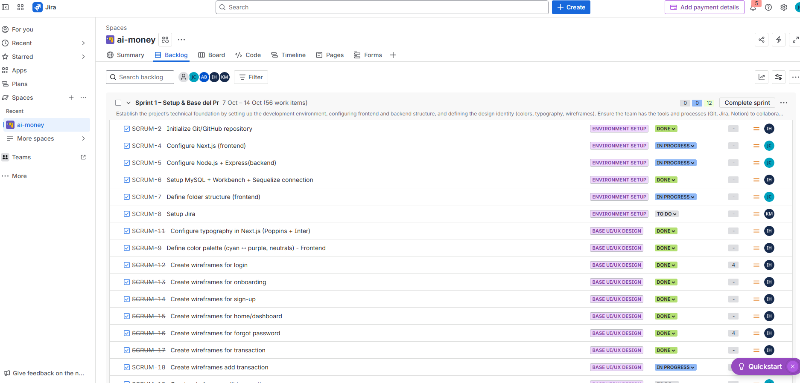

# ai money App

Complete personal financial management application with artificial intelligence, designed to help you control your finances, set goals, and make smart decisions about your money.

## Overview

**ai money App** is a modern financial management platform that combines data analysis, smart budgets, and an AI assistant to provide a complete personal finance management experience. The application allows users to track transactions, set financial goals, create budgets, and gain valuable insights into their spending habits.

## Screenshots

### Login


_Secure authentication interface with email, Google, and GitHub login options_

### Dashboard Home


_Main dashboard showing total balance, income, expenses, and budget comparison_

### Transactions


_Transaction management interface with filters and search capabilities_

### Wallet


_Multi-account wallet management with balance overview_

### Analytics


_Detailed financial analytics with income vs expenses charts and savings trends_

### Goals


_Financial goals tracking and progress monitoring_

### My Account


_User profile and account settings management_

## Key Features

### Financial Management

- **Multiple Accounts**: Manage checking, savings, credit card accounts, and more
- **Transactions**: Record and categorize income and expenses
- **Multi-currency Support**: USD, EUR, GBP, COP, and more
- **Smart Categorization**: Organize your expenses by customizable categories

### Analytics & Insights

- **Interactive Dashboard**: Visualize your financial activity in real-time
- **Financial Reports**: Generate detailed reports of your finances
- **Spending Patterns**: Identify trends and consumption habits
- **Savings Rate**: Monitor your savings progress

### Goals & Budgets

- **Financial Goals**: Set and track savings objectives
- **Budget Planning**: Create customized monthly budgets
- **Progress Tracking**: Visualize your progress towards your goals
- **Budget Alerts**: Receive notifications when approaching your limits

### AI Assistant

- **Natural Language Processing**: Create transactions using natural language commands
- **Intelligent Analysis**: Get recommendations based on your financial patterns
- **Automation**: Simplify repetitive tasks with AI

### User Management

- **Secure Authentication**: Login with email, Google, or GitHub
- **Roles and Permissions**: Role system (Admin, User)
- **Customizable Profiles**: Configure your preferences and settings
- **Guided Onboarding**: Step-by-step initial setup process

### System Configuration

- **Flexible Plans**: Free, Premium, and Enterprise
- **Security Levels**: Customizable security configuration
- **Multi-language Support**: Interface available in multiple languages
- **User Preferences**: Personalize your experience

## Project Architecture

The project is divided into two main components:

```
ai-money-app/
├── ui/              # Frontend - Next.js Application
├── backend/         # Backend - Node.js/Express API
└── README.md        # This file
```

### Frontend (UI)

Modern web application built with Next.js 15.5.4 and React 19.

**Main technologies:**

- **Framework**: Next.js 15.5.4 with Turbopack
- **UI**: React 19.1.0, TailwindCSS 4
- **Authentication**: Clerk
- **Forms**: React Hook Form + Zod
- **Charts**: Recharts
- **Export**: jsPDF, html2canvas
- **Notifications**: React Hot Toast, Sonner

[View complete Frontend documentation →](./ui/README.md)

### Backend (API)

Robust RESTful API built with Node.js and Express.

**Main technologies:**

- **Framework**: Express 5.1.0
- **Database**: MySQL with Sequelize ORM
- **Authentication**: JWT + bcrypt
- **Email**: Nodemailer
- **TypeScript**: Complete static typing

**Main endpoints:**

- `/api/auth` - Authentication and authorization
- `/api/users` - User management
- `/api/accounts` - Financial accounts
- `/api/transactions` - Transactions
- `/api/budgets` - Budgets
- `/api/goals` - Financial goals
- `/api/analytics` - Analysis and reports
- `/api/categories` - Expense categories
- `/api/settings` - User settings

[View complete Backend documentation →](./backend/README.md)

## Database

**Engine**: MySQL (ai_money_db)

**Main tables:**

- `users` - System users
- `accounts` - Financial accounts
- `transactions` - Transaction history
- `budgets` - Budgets
- `goals` - Financial goals
- `analytics` - Metrics and analysis
- `settings` - User settings
- `categories` - Expense categories
- `currencies` - Supported currencies
- `roles` - User roles
- `plans` - Subscription plans

## Quick Start

### Prerequisites

- Node.js 20+
- MySQL 8.0+
- npm or yarn

### Installation

1. **Clone the repository**

```bash
git clone https://github.com/joseCardona12/ai-money-app.git
cd ai-money-app
```

2. **Setup the Backend**

```bash
cd backend
npm install
# Configure environment variables (.env)
npm run dev
```

3. **Setup the Frontend**

```bash
cd ui
npm install
# Configure environment variables (.env.local)
npm run dev
```

4. **Access the application**

- Frontend: http://localhost:3000
- Backend API: http://localhost:3001

## Available Scripts

### Frontend (UI)

```bash
npm run dev      # Start development server
npm run build    # Build for production
npm run start    # Start production server
npm run lint     # Run linter
```

### Backend

```bash
npm run dev      # Start development server with nodemon
npm run build    # Compile TypeScript to JavaScript
npm run start    # Start production server
```

## Security

- **JWT Authentication**: Secure tokens for user sessions
- **Password Encryption**: bcrypt for password hashing
- **CORS Configured**: Protection against unauthorized requests
- **Data Validation**: Zod for frontend validation
- **Error Middleware**: Centralized error handling

## System Modules

### 1. User Management

- Registration and authentication
- User profiles
- Role management
- Preference configuration

### 2. Financial Management

- Bank accounts
- Transactions (income/expenses)
- Wallet management
- Multi-currency support

### 3. Analytics & Insights

- Analysis dashboard
- Financial reports
- Spending patterns
- Savings rate tracking

### 4. Goals & Budgets

- Financial goals
- Budget planning
- Goal tracking
- Progress monitoring

### 5. System Configuration

- Plans (Free, Premium, Enterprise)
- Security levels
- Languages and localization
- User preferences

## Project Management

This project was managed using **Jira** for agile project management, task tracking, and sprint planning.

### Jira Board Overview

The project utilized Jira's Scrum methodology with the following workflow:

- **TO DO**: Tasks ready to be started
- **IN PROGRESS**: Tasks currently being worked on
- **IN REVIEW**: Tasks completed and awaiting review
- **DONE**: Completed and approved tasks

### Sprint Planning

The development was organized into sprints, with Sprint 1 focusing on:

**Sprint 1 - Setup & Base del Proyecto** (7 Oct - 14 Oct, 56 work items)

- Environment setup (Jira, Next.js, Node.js, MySQL)
- Project structure definition (frontend & backend)
- Database design and connection
- Base UI/UX design (wireframes, color palette, typography)
- Git/GitHub repository initialization


_Jira board showing project tasks organized by status_


_Sprint 1 backlog with detailed task breakdown_

### Task Categories

Tasks were organized using labels:

- **ENVIRONMENT SETUP**: Development environment configuration
- **BASE UI/UX DESIGN**: Design system and wireframes
- **IN PROGRESS**: Active development tasks
- **DONE**: Completed features

### Team Collaboration

Jira enabled effective team collaboration through:

- Clear task assignments and ownership
- Progress tracking and sprint velocity
- Transparent workflow visualization
- Integrated code reviews and deployments

## Contributing

Contributions are welcome. Please:

1. Fork the project
2. Create a feature branch (`git checkout -b feature/AmazingFeature`)
3. Commit your changes (`git commit -m 'Add some AmazingFeature'`)
4. Push to the branch (`git push origin feature/AmazingFeature`)
5. Open a Pull Request

## License

This project is private and under active development.

## Author

**Team ai money**
-Isabel Henao(QA)
-Keyny M (Backend structure)
-Alejandro Barrios (Backend - Database)
-Jose Simón Barreto Cardona (Tech Lead - Frontend)

- Email: josesimonbarreto.design@gmail.com
- GitHub: [@joseCardona12](https://github.com/joseCardona12)

## Support

For support and questions, please contact the development team.

---

**Last updated**: 2025-10-30
**Version**: 1.0.0
**Status**: Under active development
