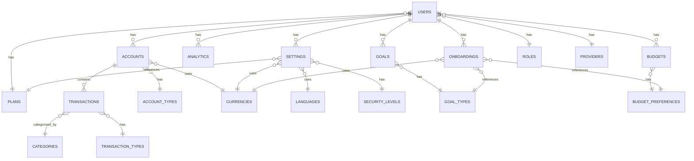
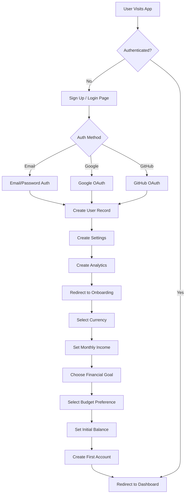
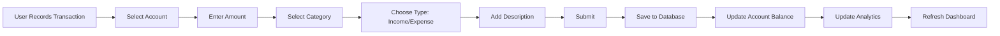
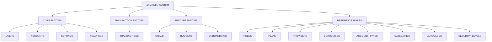
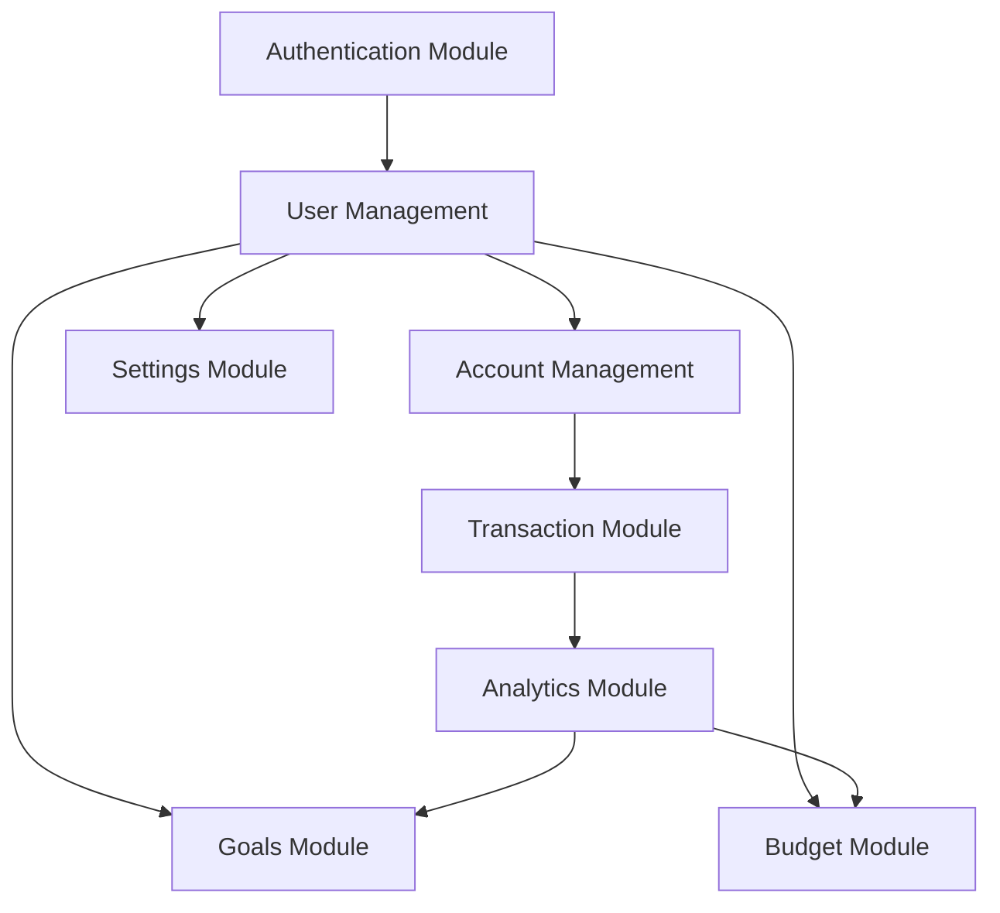
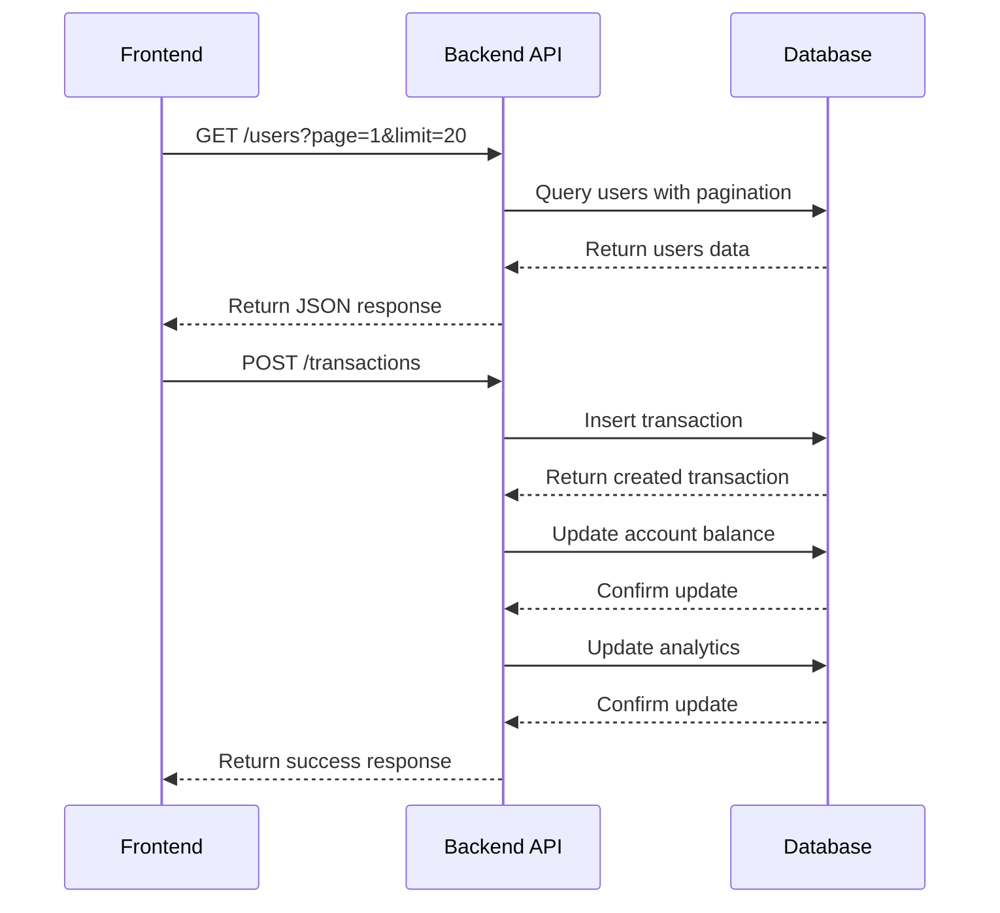
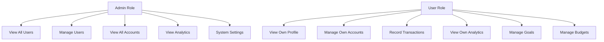
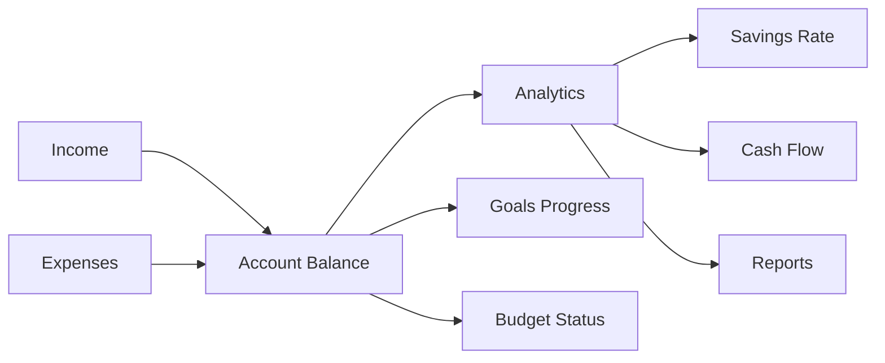
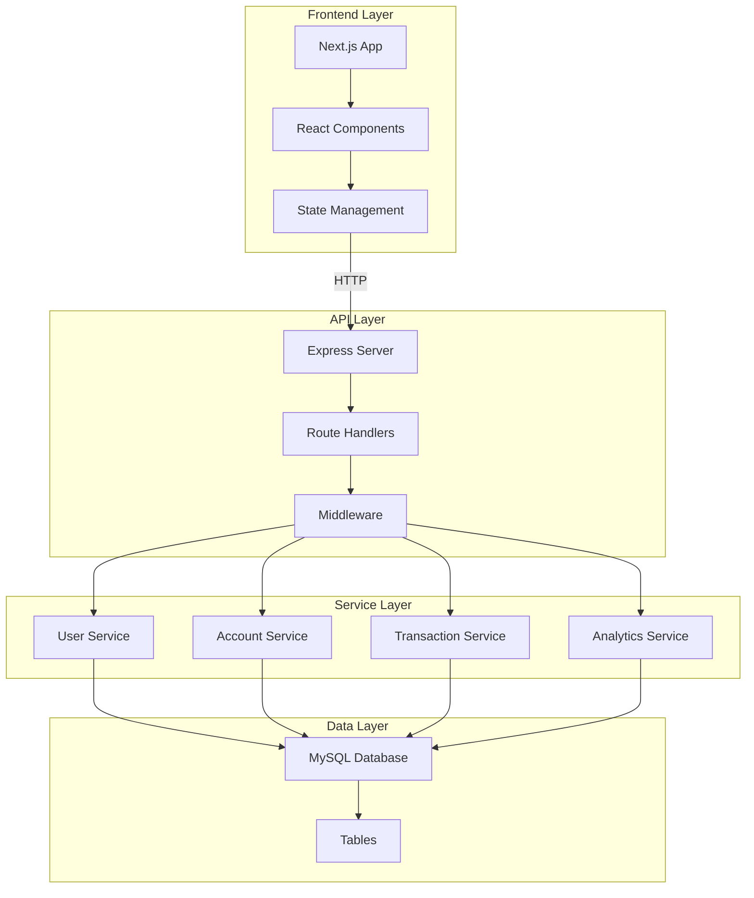

# AI-Money Mermaid Diagrams

## 1. Entity Relationship Diagram (ERD)

## 2. User Authentication Flow

## 3. Transaction Flow

## 4. Data Hierarchy

## 5. Module Dependencies

## 6. API Request Flow

## 7. User Roles & Permissions

## 8. Financial Data Flow

## 9. System Architecture

## 10. Plan Features Matrix

```mermaid
graph TD
    FREE["Free Plan"]
    PREMIUM["Premium Plan"]
    ENTERPRISE["Enterprise Plan"]
    
    FREE --> F1["✓ Basic Accounts"]
    FREE --> F2["✓ Transaction Tracking"]
    FREE --> F3["✓ Basic Analytics"]
    FREE --> F4["✗ Advanced Reports"]
    FREE --> F5["✗ AI Insights"]
    
    PREMIUM --> P1["✓ Unlimited Accounts"]
    PREMIUM --> P2["✓ Advanced Analytics"]
    PREMIUM --> P3["✓ Goal Tracking"]
    PREMIUM --> P4["✓ Budget Management"]
    PREMIUM --> P5["✗ Priority Support"]
    
    ENTERPRISE --> E1["✓ Everything in Premium"]
    ENTERPRISE --> E2["✓ Priority Support"]
    ENTERPRISE --> E3["✓ Custom Reports"]
    ENTERPRISE --> E4["✓ API Access"]
    ENTERPRISE --> E5["✓ Dedicated Account Manager"]
```

---

**Cómo usar estos diagramas en Notion:**

1. Copia el código Mermaid
2. En Notion, crea un bloque de código
3. Selecciona "Mermaid" como lenguaje
4. Pega el código
5. El diagrama se renderizará automáticamente

**Alternativas:**
- Lucidchart: Importa como diagrama
- Miro: Copia y pega
- Draw.io: Importa XML
- MindMeister: Crea manualmente basado en la estructura

